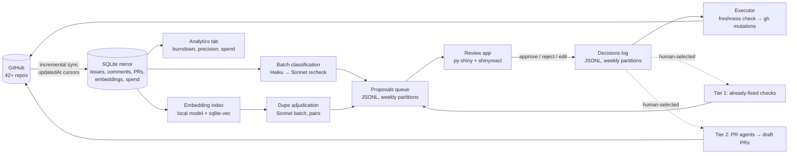

# Shinyverse Issue Triage Hub — Design

- **Date:** 2026-06-12
- **Owner:** Barret Schloerke
- **Status:** Approved design, pre-implementation
- **Repo:** `rstudio/shiny-issue-triage` (the "hub")

## 1. Problem & goals

The shinyverse (the 32 R packages tracked by `rstudio/shinycoreci` plus the Python ecosystem: py-shiny, py-htmltools, py-shinywidgets, shinylive, chatlas, shinychat, querychat, brand-yml, great-tables, …) carries **~4,200 open issues across 42 repos** (counted 2026-06-12; top five: shiny 790, plotly.R 711, py-shiny 411, gt 312, leaflet 300). The existing weekly triage workflow caps at 150 issues/week — a 14-week first pass at best, with no dedup and no close pipeline.

**Goals**

1. Drain the backlog to a maintainable set at a rapid pace: labels, priority, dedup (including cross-repo), and closes ({duplicate, stale, not-planned, fixed-already, needs-info-expired}).
2. Steady-state triage of incoming issues at near-zero marginal cost.
3. Launch implementation agents (draft PRs) for human-selected issues.
4. Hard cost discipline: metered enterprise API for every token; spend must be a config dial, never an emergent property of GitHub traffic.
5. Multi-tenant-ready: another team adopts by templating the hub repo + config, not by new infrastructure.

**Non-goals (v1)**

- Hosted multi-tenant platform or any r-universe-scale infrastructure.
- Auto-merge of agent PRs; PRs are always drafts.
- Per-repo maintainer approval flows (single-gate review first; see [Review queue & graduation](#6-review-queue-decisions-graduated-autonomy)).
- Public-facing analytics dashboard (deferred to Phase 6).
- GitHub Projects as system of record; `gh aw` as execution engine (see [Decisions](#2-decisions-and-rejected-alternatives)).

## 2. Decisions and rejected alternatives

| Decision | Rationale |
|---|---|
| **GitHub is the source of truth**; the hub owns a derived working copy | Labels/close-states/timelines stay community-visible and survive tooling changes. The mirror is rebuildable from GitHub at any time, so it can never be "lost," only stale — and writes never depend on mirror freshness (see the [freshness contract](#4-mirror--sync)). |
| **No GitHub Projects** as state store or analytics engine | Projects Insights charts are UI-only (no API/export — confirmed 2026-06). Item-limit is no longer a blocker (50k since Feb 2025), but Projects would be a second source of truth maintained via rate-limited GraphQL mutations, returning analytics we can compute better ourselves from issue timestamps — retroactively, for all history. A read-only stakeholder Project view may be added later; it is never authoritative. |
| **No `gh aw`** as foundation | Technical preview; retired releases 0.68.4–0.71.3 over a billing bug (2026-04); would push per-repo workflow sprawl across 42 repos. Its safe-outputs concept is already implemented in this repo (`process-triage-actions.mjs` + allowlisted labels). Re-evaluate ~2026-12. |
| **No `wshm`** (or similar third-party agents) — but adopted as a reference implementation | Evaluated twice, including a fork-and-build option. 12 weeks old, 2 contributors, 61 stars; ~30k lines of Rust by 2 authors = a permanent audit/maintenance obligation outside the team's languages. License is SSPL-1.0: internal use is fine, but SSPL §3 conflicts with this program's "open it up" end-state, and a fork can never be re-licensed. Running the free binary would also hand it the enterprise API key + GitHub write tokens. Decision: read it, don't run it — three ideas lifted into this spec (executor `undo`, apply-requires-flag default, PR scoring rubric for P5). |
| **Centralized, batched model calls** — never per-GitHub-event agent runs | Cost scales with issues we choose to process, not with event traffic. Batch API = 50% off; prompt caching for the shared rubric prefix. |
| **Single human gate now (Barret), graduated autonomy later** | Every public mutation is human-approved in v1. Decision logs accumulate per-category precision; a category graduates to auto-apply when it sustains the precision bar ([Review queue & graduation](#6-review-queue-decisions-graduated-autonomy)). |
| **Mirror includes closed issues, all comments, and PRs** | Dedup must match against fixed/closed issues; burndown backfill needs `closedAt`; `closingIssuesReferences` powers "already fixed?" checks. Closed issues are indexed/analyzed but **never batch-classified** (no action to take), so model spend is unchanged. |
| **Local embeddings** | Retrieval-only role (adjudication is LLM); free; no second vendor. Default model: `sentence-transformers/all-MiniLM-L6-v2`, swappable in config. |
| **SQLite is the canonical mirror; release assets carry snapshots; the git branch carries only small append-only logs** | Full comment threads put the mirror at hundreds of MB — wrong for git history. Snapshots publish as GitHub Release assets on the hub repo (versioned, fetchable by CI and laptop). `triage-state` branch keeps `cursors.json` + weekly-partitioned JSONL logs. |
| **Pipeline in Python (`uv`), GitHub-mutation layer stays Node** | New data-plane code (sync, embed, batch, analytics) is Python with the Anthropic SDK. The existing, tested `gh-token-router.mjs` / `process-triage-actions.mjs` layer evolves rather than being rewritten. |
| **Review app + dashboard: Shiny for Python + `shinyreact` (ui.tsx pattern)** | Dogfooding team infrastructure. Server is reactive computation only (`set_react_page()`); React client in `ui.tsx` with `useShinyInput`/`useShinyOutputValue`; npm build expected. `shinyreact` is private/pre-release: pin a commit and vendor the wheel. |
| **Billing: metered enterprise API** | Every token is paid. All stages log usage to the spend table; caps in config ([Cost model](#8-cost-model--controls)). |

## 3. Architecture



Everything above the executor reads only the mirror. The executor is the single component that mutates GitHub, and it re-verifies freshness per issue before each mutation.

## 4. Mirror & sync

**Store:** one SQLite file (`mirror.sqlite`, gitignored). Tables:

- `repos(owner, name, installation_id, last_synced_at)`
- `issues(repo, number, title, body, state, state_reason, author, labels_json, assignees_json, milestone, comment_count, reactions_json, created_at, updated_at, closed_at, is_pr)`
- `comments(repo, issue_number, comment_id, author, body, created_at, updated_at)`
- `prs(repo, number, merged, merged_at, closing_issue_refs_json, head_ref, base_ref)` (extends `issues` rows where `is_pr`)
- `embeddings(repo, issue_number, vector)` via `sqlite-vec`
- `spend(run_id, stage, model, input_tokens, cached_tokens, output_tokens, usd, at)`
- `runs(run_id, kind, started_at, finished_at, summary_json)`

**Sync:** per-repo GraphQL pagination ordered by `updatedAt`, resuming from `cursors.json` (existing convention). Backfill = same query, no cursor; open + closed; full comment threads. The cursor keys on the **issue's `updatedAt`, which GitHub bumps on every new comment** — so a comment on an issue created long before the cursor position re-enters that issue into the sync window, and its comment thread is then fetched incrementally with a per-issue `since` filter. Idempotent upserts; embeddings recomputed when `title+body` hash changes. Rate budget: GraphQL 5k points/hour per installation token — backfill of the full corpus (~25–50k issues incl. closed) completes within a few hours across installations and is a one-time event; incremental syncs are seconds.

**Snapshots:** a rolling **`mirror-latest`** release has its asset replaced after every successful sync or batch run, so consumers always have a fresh bootstrap point; dated tags (`mirror-YYYY-MM-DD`, keep last 8) are additionally cut after each blitz wave and at least weekly as restore points. CI jobs and fresh laptops bootstrap by downloading `mirror-latest` (`mirror.sqlite.zst`), then incremental-sync to current.

**Freshness contract:** before any mutation, the executor re-fetches that one issue; if `updatedAt` differs from the value recorded in the proposal, the action is not executed — it returns to the queue flagged `stale-needs-rereview`. Mirror staleness can therefore never cause a wrong write, only a bounced action.

## 5. Analysis pipeline

**5.1 Embedding index.** `title + body` (truncated ~8k chars) per issue, open and closed, all repos in one index. Used for retrieval only.

**5.2 Dupe candidates → adjudication.** For each open issue: top-10 nearest neighbors above cosine threshold (tuned in pilot; start 0.80). Candidate pairs go to **Sonnet via Batch API** with structured output: `{verdict: duplicate|related|distinct, canonical: issue_ref, rationale, confidence}`. Cross-repo pairs (e.g., shiny↔py-shiny, bslib↔shiny) carry sub-options `{close-and-link | transfer | keep-both-link}`. Pairs are deduplicated and cached: a pair is never re-adjudicated unless either side's content changed.

**5.3 Classification.** Open issues only. **Haiku via Batch API**, structured output:

```
{type: bug|feature|question|docs|chore,
 priority: critical|high|normal|low,
 assessment: actionable|needs-info|stale|likely-fixed|out-of-scope,
 labels: [from labels.yaml allowlist],
 close_candidate: null | {reason: duplicate|stale|not-planned|fixed|answered, rationale, confidence},
 confidence: 0..1}
```

Prompt = shared cached prefix (the existing `issue-triage-rubric.md` + label taxonomy + a short per-repo blurb) + issue title/body/recent comments. Anything with `confidence < 0.7` **or any `close_candidate`** gets a **Sonnet** second pass with the full comment thread — closes are always double-checked by the stronger model before a human ever sees them.

**5.4 Prompt-injection guardrail.** Issue bodies and comments are untrusted input. Classification/adjudication outputs are schema-constrained enums + rationale text; rationale is displayed in the review app but never executed. The executor acts only on allowlisted mutation types with allowlisted labels (existing `process-triage-actions.mjs` pattern). Escalation-tier agents ([Executor & escalation tiers](#7-executor--escalation-tiers)) run on read-only checkouts and can only emit proposals, never direct mutations.

## 6. Review queue, decisions, graduated autonomy

**Proposals** append to `proposals/YYYY/Www.jsonl`: `{id, repo, issue, action, params, rationale, confidence, evidence: [urls], issue_updated_at, run_id, model}`.

**Review app** (py-shiny + shinyreact ui.tsx, run locally from the hub repo): proposals grouped by action type, sorted by confidence; evidence pane (issue text, neighbor issues, rationale); keyboard-driven approve / reject / edit / skip; bulk approve for high-confidence groups. Target throughput: ~50 decisions in ~10 minutes. Decisions append to `decisions/YYYY/Www.jsonl` with the reviewer verdict and timestamp.

**Dashboard** is a tab in the same app: backlog burndown per repo (backfilled from `created_at`/`closed_at` — history renders from before this project existed), opened-vs-closed per week, close-reason mix, triage coverage, queue depth/throughput, per-category precision, and per-stage spend.

**Issue/PR drawer:** anywhere an issue or PR appears in the app (queue, dashboard, dupe pairs), clicking it opens a slide-over drawer rendering the full item from the mirror — title, body, comment thread, labels, state, linked evidence — GitHub-Projects-style, with a deep link out to GitHub. Review never requires leaving the app.

**Graduated autonomy (the B→D path):** every decision is labeled with its proposal category. A category may be promoted to auto-apply when it sustains **≥98% approval over ≥200 consecutive human-reviewed decisions**, and then only above a confidence floor (start 0.9), with 10% random spot-audit sampling and automatic demotion if a reopened issue or failed audit drops trailing precision below the bar. Reopens of agent-closed issues are tracked as precision failures.

## 7. Executor & escalation tiers

**Executor** (evolves `process-triage-actions.mjs` + `gh-token-router.mjs`): reads approved decisions → [freshness check](#4-mirror--sync) → applies via `gh` using the per-installation GitHub App token map (existing): `label add/remove`, `comment` (from approved templates only), `close --reason {completed|not-planned}`, `close --duplicate-of N`, `reopen`. **Dry-run is the default; mutations require an explicit `--apply` flag.** Appends results to `results/YYYY/Www.jsonl` — including created comment IDs and prior label/state per issue — and updates the mirror row. Mutation pacing ~1/sec.

**Undo (lifted from `wshm revert`):** every executed batch gets a batch id, and result records capture enough to reverse each mutation (label add↔remove, close↔reopen, comment→delete by recorded comment id). `undo --batch <id>` reverses a whole batch (or `--issue` for one item); undo actions are themselves logged to results. Issue *transfers* are not cleanly reversible — they are excluded from the undo guarantee and therefore require an extra confirmation step in the review app if ever enabled.

**Comment templates** (in `config/templates/`): polite, evidence-linked, state that a maintainer approved the action, and invite reopening. No free-text model output is ever posted in v1.

**Tier 1 — "already fixed?" checks:** issues assessed `likely-fixed` (or with merged linked PRs) queue for a non-interactive Claude Code session: repo checkout, NEWS/changelog + `git log` search, attempt to map the report to a fixed change; emits a proposal `close as fixed in vX.Y` with evidence links. Cap: `tier1_max_per_day` (start 25).

**Tier 2 — PR implementation:** human-selected issues only. Claude Code sessions produce **draft PRs** referencing the issue; never auto-merge. Cap: `tier2_max_per_week` (start 10). Model per config (default Sonnet; Opus for hard ones, explicitly chosen at launch time).

## 8. Cost model & controls

Prices as of 2026-06 (Batch API = 50% off; cache reads 0.1×): Haiku $0.50/$2.50 per MTok batch; Sonnet $1.50/$7.50 batch; Opus $2.50/$12.50 batch.

| Stage | Volume (blitz) | Est. cost |
|---|---|---|
| Sync + embeddings (local) | ~25–50k issues | $0 (rate limits only) |
| Haiku classification | ~4.3k open issues | ~$11 |
| Sonnet second pass | ~30% of open + all close-candidates | ~$15 |
| Sonnet dupe adjudication | ~5–8k pairs | ~$25–35 |
| **Blitz total (data plane)** | | **~$50–100 one-time** |
| Steady-state classification | ~50–150 new/updated per week | <$2/week |
| Tier 1 sessions | ≤25/day, ~$0.5–2 each | ≤$50/day, dial-controlled |
| Tier 2 PR agents | ≤10/week, ~$2–10 each | ≤$100/week, dial-controlled |

Controls in `config/models.yaml`: model per stage, confidence thresholds, tier caps, `batch_only: true` for all bulk stages, and a global `max_usd_per_day` circuit breaker — the pipeline halts new model calls when the spend table crosses it. Every API response's `usage` block is written to `spend` with computed USD.

## 9. Labels & public state

Reuses `config/labels.yaml` (existing taxonomy + `allowed_safe_output_labels` validator). Public `ai-triage:*` labels mark only executed outcomes (e.g., `ai-triage:done`, `human-reviewed`); proposals and rejections stay internal to the hub. All closes use proper close reasons so GitHub's own UI/search reflect reality (`duplicate` via `--duplicate-of`). Issues skip re-triage while carrying skip-labels (existing convention).

## 10. Steady state

A scheduled hub Action (start: every 12h) runs sync → classify new/updated → adjudicate new dupe candidates → append proposals, and posts a one-line summary to the run log. Nothing is executed without a human decision until categories graduate ([Review queue & graduation](#6-review-queue-decisions-graduated-autonomy)). The existing weekly `team-issue-triage.yml` (agentic session in CI) is retired once the pilot completes; its scripts live on in the executor. `claude-code-action` remains available for interactive `@claude` mentions on repos, unchanged by this design.

## 11. Multi-tenancy & opening up (Phase 6)

Everything tenant-specific lives in `config/`: `repos.yaml`, `labels.yaml`, `rubric.md`, `models.yaml`, `templates/`. Adoption = template the hub repo, install the GitHub App on target repos, set two secrets (App credentials, Anthropic key), edit config. Deliverables at this phase: adoption docs, secrets checklist, and a public read-only dashboard (static export or deployed app — decided then, not now).

## 12. Testing

- **Sync:** recorded-fixture tests (GraphQL responses → expected rows), cursor resume, upsert idempotency, and a comment-recapture test (comment added to an issue created before the cursor position → issue re-enters the sync window and the new comment lands in the mirror).
- **Classification:** golden-set regression — a sample of real issues with human-verified expected outputs, run on prompt/model changes; the pilot's human decisions seed this set.
- **Dedup:** known-duplicate pairs from historical closes (`duplicate` close reason) as recall tests.
- **Executor:** dry-run snapshot tests; explicit freshness-conflict test (mutate fixture issue between proposal and execution → expect bounce); undo round-trip test (execute fixture batch → undo → original labels/state/comments restored).
- **Apps:** py-shiny test fixtures for server logic; Playwright smoke test for the queue flow.
- Existing pytest + `node:test` setups extend; CI runs all of the above without network (fixtures only).

## 13. Rollout phases & exit criteria

| Phase | Scope | Exit criteria |
|---|---|---|
| **P1 Mirror + analytics** | Sync all 42 repos (open+closed+comments+PRs), snapshot publishing, burndown renders in app | Counts reconcile with GitHub search; snapshot bootstrap works on a clean machine; $0 model spend |
| **P2 Pilot** | reactlog (25), shinytest2 (59), py-shinylive (8) — same trio as the P1 mirror pilot: full loop — classify, dedup, queue, human review, execute real closes/labels | Every action type exercised on real issues; measured precision per category; cost within [cost-model](#8-cost-model--controls) estimates; golden set seeded |
| **P3 Blitz waves** | Remaining repos small→large; shiny + plotly.R last | First-pass triage coverage 100% of open backlog; queue throughput sustained ≥200 decisions/week |
| **P4 Steady state + first graduations** | 12h schedule on; first categories hit the [graduation bar](#6-review-queue-decisions-graduated-autonomy) | ≥1 category auto-applying with spot-audits; reopen rate <1% on executed closes |
| **P5 PR tiers** | Tier 1 at scale; Tier 2 launches; PR triage rubric (stale/superseded community PRs; wshm's scoring dimensions — CI status, reviews, age, risk, conflicts — as reference material) | Draft-PR flow proven end-to-end; PR-triage proposals reviewed like issues |
| **P6 Open it up** | Template repo, docs, public dashboard | Second team adopts without hub-team code changes |

Note for P3: `ropensci/plotly` now lives at `plotly/plotly.R` — confirm GitHub App installability on the `plotly` org before its wave; if not installable, it drops from scope (config change, not code).

## 14. Risks

| Risk | Mitigation |
|---|---|
| Mass-closing damages community trust | Single human gate in v1; polite evidence-linked templates; proper close reasons; reopens tracked as failures; graduated autonomy only after sustained precision; batch `undo` can reverse any executed decision set ([Executor](#7-executor--escalation-tiers)) |
| Prompt injection via issue content | Schema-constrained outputs; allowlisted mutations/labels; agents emit proposals only ([prompt-injection guardrail](#5-analysis-pipeline)) |
| Spend runaway | Batch-only bulk stages; tier caps; `max_usd_per_day` circuit breaker; spend dashboard |
| `shinyreact` is pre-release | Pin commit + vendor wheel; app is internal-only in v1 |
| Review-queue fatigue (single gate) | Confidence sorting + bulk approve; graduation path explicitly reduces human load over time |
| GraphQL rate limits during backfill | Per-installation tokens spread budget; backfill is resumable via cursors |
